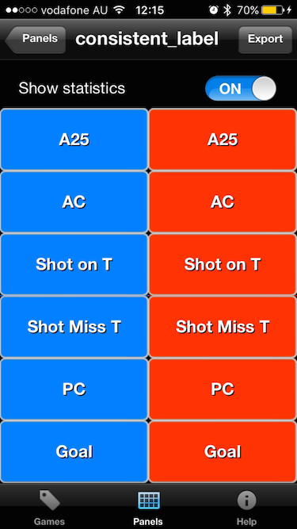

# EasyTagGenerator

This project creates panels for the DartFish EasyTag application tlo more easily enable event capturing to be performed.

The focus mainly is on using EasyTag to capture game statistics that can then be exported and analysed/stored for later view.

## Options

| Flag | Required | Description |
| ---- | ----------- |----------|
| `-n <value>`  | False |  Name of the panel |
| `-h <home>`  | False, defaults to Home|Name of home team |  
| `-o <opponent>`  | False, defaults to Opp|Name of opponent |  
| `-hcol <hex color>`  | False, defaults to blue|Color of home buttons |  
| `-hopp <hex color>`  | False, defaults to red|Color of opponent buttons |  
| `-stats [stat,stat,...]`  | False, defaults to [A25, AC, Shot on T, Shot Miss T, PC, Goal]|Comma separated list of stats to capture |  

## Default Generation

When executed with no parameters a default XML file is generated that produces the EasyTag panel as shown belowL:



**Default XML file**

```
<?xml version="1.0" encoding="UTF-8" standalone="no" ?>
<EasyTagPanel>
  <name>Home v Opp</name>
  <height>6</height>
  <width>2</width>
  <showStatistics>1</showStatistics>
  <pushers>
    <pusher index="0">
      <x>0</x>
      <y>1</y>
      <label>A25</label>
      <value>Home</value>
      <category>Home A25</category>
      <visible>1</visible>
      <showHits>1</showHits>
      <color>0080FF</color>
      <duration>0</duration>
      <preroll>0</preroll>
    </pusher>
    <pusher index="2">
      <x>0</x>
      <y>2</y>
      <label>AC</label>
      <value>Home</value>
      <category>Home AC</category>
      <visible>1</visible>
      <showHits>1</showHits>
      <color>0080FF</color>
      <duration>0</duration>
      <preroll>0</preroll>
    </pusher>
    <pusher index="4">
      <x>0</x>
      <y>3</y>
      <label>Shot on T</label>
      <value>Home</value>
      <category>Home Shot on T</category>
      <visible>1</visible>
      <showHits>1</showHits>
      <color>0080FF</color>
      <duration>0</duration>
      <preroll>0</preroll>
    </pusher>
    <pusher index="6">
      <x>0</x>
      <y>4</y>
      <label>Shot Miss T</label>
      <value>Home</value>
      <category>Home Shot Miss T</category>
      <visible>1</visible>
      <showHits>1</showHits>
      <color>0080FF</color>
      <duration>0</duration>
      <preroll>0</preroll>
    </pusher>
    <pusher index="8">
      <x>0</x>
      <y>5</y>
      <label>PC</label>
      <value>Home</value>
      <category>Home PC</category>
      <visible>1</visible>
      <showHits>1</showHits>
      <color>0080FF</color>
      <duration>0</duration>
      <preroll>0</preroll>
    </pusher>
    <pusher index="10">
      <x>0</x>
      <y>6</y>
      <label>Goal</label>
      <value>Home</value>
      <category>Home Goal</category>
      <visible>1</visible>
      <showHits>1</showHits>
      <color>0080FF</color>
      <duration>0</duration>
      <preroll>0</preroll>
    </pusher>
    <pusher index="1">
      <x>1</x>
      <y>1</y>
      <label>A25</label>
      <value>Opp</value>
      <category>Opp A25</category>
      <visible>1</visible>
      <showHits>1</showHits>
      <color>FF3300</color>
      <duration>0</duration>
      <preroll>0</preroll>
    </pusher>
    <pusher index="3">
      <x>1</x>
      <y>2</y>
      <label>AC</label>
      <value>Opp</value>
      <category>Opp AC</category>
      <visible>1</visible>
      <showHits>1</showHits>
      <color>FF3300</color>
      <duration>0</duration>
      <preroll>0</preroll>
    </pusher>
    <pusher index="5">
      <x>1</x>
      <y>3</y>
      <label>Shot on T</label>
      <value>Opp</value>
      <category>Opp Shot on T</category>
      <visible>1</visible>
      <showHits>1</showHits>
      <color>FF3300</color>
      <duration>0</duration>
      <preroll>0</preroll>
    </pusher>
    <pusher index="7">
      <x>1</x>
      <y>4</y>
      <label>Shot Miss T</label>
      <value>Opp</value>
      <category>Opp Shot Miss T</category>
      <visible>1</visible>
      <showHits>1</showHits>
      <color>FF3300</color>
      <duration>0</duration>
      <preroll>0</preroll>
    </pusher>
    <pusher index="9">
      <x>1</x>
      <y>5</y>
      <label>PC</label>
      <value>Opp</value>
      <category>Opp PC</category>
      <visible>1</visible>
      <showHits>1</showHits>
      <color>FF3300</color>
      <duration>0</duration>
      <preroll>0</preroll>
    </pusher>
    <pusher index="11">
      <x>1</x>
      <y>6</y>
      <label>Goal</label>
      <value>Opp</value>
      <category>Opp Goal</category>
      <visible>1</visible>
      <showHits>1</showHits>
      <color>FF3300</color>
      <duration>0</duration>
      <preroll>0</preroll>
    </pusher>
  </pushers>
</EasyTagPanel>

```

To specify changes such as team names, button colours and stats the options can be utilitized.

The command:

```./easytag.sg -n Simple -h AHC -o NEHC -stats Shot,Save,Miss,Score```

Produces the panel:


From the XML:

```
<?xml version="1.0" encoding="UTF-8" standalone="no" ?>
<EasyTagPanel>
  <name>Simple</name>
  <height>4</height>
  <width>2</width>
  <showStatistics>1</showStatistics>
  <pushers>
    <pusher index="0">
      <x>0</x>
      <y>0</y>
      <label>Shot</label>
      <value>Shot AHC</value>
      <category>Shot AHC</category>
      <visible>1</visible>
      <showHits>1</showHits>
      <color>0080FF</color>
      <duration>0</duration>
      <preroll>0</preroll>
    </pusher>
    <pusher index="2">
      <x>0</x>
      <y>1</y>
      <label>Miss</label>
      <value>Miss AHC</value>
      <category>Miss AHC</category>
      <visible>1</visible>
      <showHits>1</showHits>
      <color>0080FF</color>
      <duration>0</duration>
      <preroll>0</preroll>
    </pusher>
    <pusher index="4">
      <x>0</x>
      <y>2</y>
      <label>Save</label>
      <value>Save AHC</value>
      <category>Save AHC</category>
      <visible>1</visible>
      <showHits>1</showHits>
      <color>0080FF</color>
      <duration>0</duration>
      <preroll>0</preroll>
    </pusher>
    <pusher index="6">
      <x>0</x>
      <y>3</y>
      <label>Score</label>
      <value>Score AHC</value>
      <category>Score AHC</category>
      <visible>1</visible>
      <showHits>1</showHits>
      <color>0080FF</color>
      <duration>0</duration>
      <preroll>0</preroll>
    </pusher>
    <pusher index="1">
      <x>1</x>
      <y>0</y>
      <label>Shot</label>
      <value>Shot NEHC</value>
      <category>Shot NEHC</category>
      <visible>1</visible>
      <showHits>1</showHits>
      <color>FF0000</color>
      <duration>0</duration>
      <preroll>0</preroll>
    </pusher>
    <pusher index="3">
      <x>1</x>
      <y>1</y>
      <label>Miss</label>
      <value>Miss NEHC</value>
      <category>Miss NEHC</category>
      <visible>1</visible>
      <showHits>1</showHits>
      <color>FF0000</color>
      <duration>0</duration>
      <preroll>0</preroll>
    </pusher>
    <pusher index="5">
      <x>1</x>
      <y>2</y>
      <label>Save</label>
      <value>Save NEHC</value>
      <category>Save NEHC</category>
      <visible>1</visible>
      <showHits>1</showHits>
      <color>FF0000</color>
      <duration>0</duration>
      <preroll>0</preroll>
    </pusher>
    <pusher index="7">
      <x>1</x>
      <y>3</y>
      <label>Score</label>
      <value>Score NEHC</value>
      <category>Score NEHC</category>
      <visible>1</visible>
      <showHits>1</showHits>
      <color>FF0000</color>
      <duration>0</duration>
      <preroll>0</preroll>
    </pusher>
  </pushers>
</EasyTagPanel>

```
